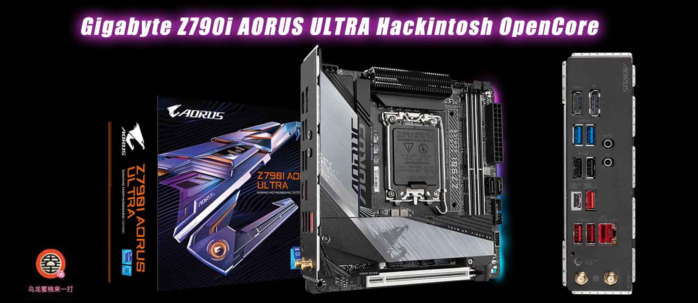

# 技嘉 Z790i AORUS ULTRA 黑苹果 OpenCore EFI



### [English](https://github.com/hackintosh-efi/ASRock-DeskMini-310)

### OpenCore

[OpenCore 0.9.7](https://github.com/acidanthera/OpenCorePkg)

### 可安装系统

- macOS Monterey 12.x 
- macOS Ventura  13.x 
- macOS Sonoma  14.x 


### 硬件

- BIOS版本: F7  2023-12-14
- 主  板: Gigabyte Z790i AORUS ULTRA
- 处理器: 英特尔 14代 i7-14700KF
- 独   显: AMD Radeon RX 6800 XT 16GB GDDR6
- 内   存: 光威天策 32GB(16GB*2) DDR5-6400 Mhz
- 固   态: 阿斯加特AN4.0 2TB   MacOS Sonoma + Windows 11
- 固   态: 希捷 FireCuda 520 1TB   Data
- 声   卡: 瑞昱 ALC4080
- 有   线: 英特尔 L225-V
- 无   线: 杀手 Killer(R) Wi-Fi 6E Ax1690i 160MHz

### BIOS设置

```
Settings
  |-- IO Ports
      |-- Above 4G Decoding: Enabled
      |-- IOAPIC 24-119 Entries: Disabled
      |-- USB Configuration
          |-- XHCI Hand-off: Enabled 
          |-- Port 60/64 Emulation: Disabled
      |-- SATA Configuration
          |-- SATA Controllers): Enabled 
  |-- Miscellaneous 
      |-- VT-D: Enabled    
Boot 
  |-- CFG Lock: Disabled
  |-- Fast Boot: Disable Link
  |-- CSM Support: Disabled
  |-- Secure Boot
      |-- Secure Boot: Disabled
```


### 注意事项

 - 安装完成后请使用 [OCAuxiliaryTools](https://github.com/ic005k/OCAuxiliaryTools/releases) 生成自己的三码
 - 如需使用没有小核心的CPU，必须取消勾选配置文件中Kernel--ProvideCurrentCpuinfo选项
 - 请使用电源键进行睡眠唤醒
 - 此EFI中的英特尔无线网卡驱动[AirportItlwm.kext](https://github.com/OpenIntelWireless/itlwm/releases)仅适用于 MacOS 14 Sonoma,安装其它版本请自行下载替换此驱动
 - 英特尔无线网卡无法使用隔空投送等功能

### 系统截图


### 联系我们

- QQ群: 23304408

